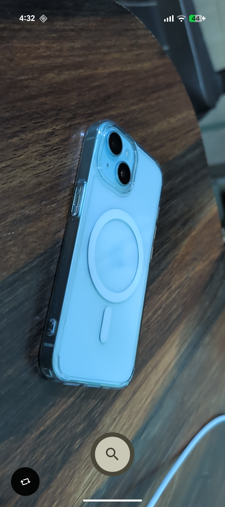
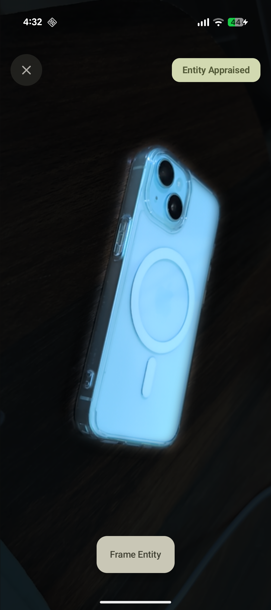
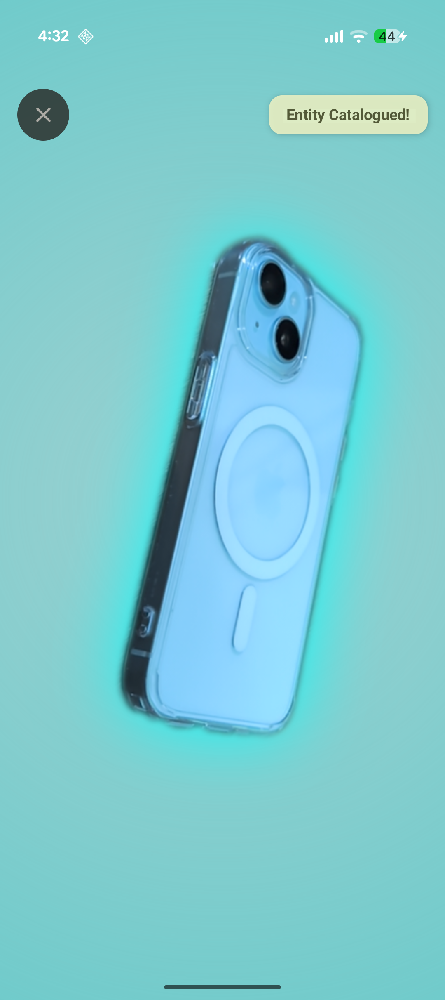

# APPRAISE
**Turn the real world into a massive, collaborative RPG collection!**

> [!NOTE]  
> **Provisional README (v0.0.1-poc)**
> 
> Appraise is currently in an early **Proof of Concept (PoC)** stage. This README is provisional and focuses *strictly* on the initial machine learning and visual extraction pipeline. Please review the [Known Issues](#known-issues) before use.
>
> **Development Lifecycle:** Appraise's core segmentation engine is complete. As the underlying LLM and Global Caching backend systems are built out, development will transition to a standard Gitflow workflow. Currently, only early Debug builds are available.

[](https://github.com/Animesh-Varma/Appraise/releases)
[](https://github.com/Animesh-Varma/Appraise/blob/master/LICENSE)

Appraise is an ambitious, gamified camera app that turns the mundane real world into a globally deduplicated collectible RPG. Point your camera at everyday objects to instantly extract them from reality and add them to your personal digital catalogue with procedurally generated stats, rarities, and lore. 

Appraise isn't just a camera app; **it is a massive collaborative project aiming to build a global encyclopedia of everyday things.** 

When an item is scanned, Appraise's backend will semantically fingerprint it to see if it's novel or if it already exists in the global cache. If it's a known item (like a standard Coke can), users might uncover custom artwork drawn by a volunteer community artist who "claimed" that specific item variant. 

This creates a powerful creator economy: artists aren't just contributing for fun. By claiming and illustrating high-traffic items, artists climb a global leaderboard. High-ranking artists gain prime real estate within the app to publicize their social media profiles and earn a direct cut of community donations based on their standing. It is a living, breathing ecosystem built around the objects naturally around you, complete with deep achievement systems and social discovery.

---

## Downloads

*Note: Appraise is in an early PoC phase and is not yet available on any distribution stores. Currently, only pre-release Debug APKs are available via GitHub.*

<div align="left">
  <a href="https://github.com/Animesh-Varma/Appraise/releases">
    
  </a>
</div>

---

<h3 align="center">Contents</h2>

<p align="center">
  <a href="#features">Features</a> •
  <a href="#how-it-works">How It Works</a> •
  <a href="#screenshots">Screenshots</a> •
  <a href="#known-issues">Known Issues</a>
  <br>
  <a href="#roadmap">Roadmap</a> •
  <a href="#technical-stack">Tech Stack</a> •
  <a href="#build-instructions">Build</a> •
  <a href="#contact">Contact</a>
</p>

---

## Features (Current v0.0.1-poc)

The current Proof of Concept focuses entirely on establishing a highly polished, premium visual extraction pipeline. After all, the app needs to make real-life objects look pristine before they can be turned into a game!

- **On-Device AI Segmentation:** Utilizes Google ML Kit (via Play Services) to instantly identify and extract the primary object from a photo. Safely migrated to support modern Android 15 / 16KB memory page hardware architectures to prevent legacy native crashes.
- **Strict Subject Isolation:** A blazing-fast, custom Kotlin Flood-Fill algorithm maps the AI's output, automatically discarding background noise and strictly enforcing a "one-object-only" rule.
- **Edge Light-Wrapping:** The UI isn't just an image slapped on a background. Appraise uses GPU-accelerated `BlurMaskFilter` passes and `SRC_IN` blending to let the background neon glow visually "bleed" through the edges of the object. This perfectly occludes real-world light reflections and imperfect AI jagged edges.
- **Material 3 Interface:** Features a snappy, edge-to-edge CameraX viewfinder paired with an expressive, animated Material 3 `FunCaptureButton`.

---

## How It Works

### **The Extraction Pipeline**
When you tap capture, Appraise captures a high-resolution frame and passes it to the local ML Kit segmentation model. Because AI models occasionally highlight annoying background artifacts, Appraise runs a secondary **Flood-Fill pass** to isolate the single largest contiguous visual mass, completely deleting stray pixels.

### **The Visual Composite**
To make mundane objects look like premium collectibles, the app dynamically composites several layers:
- **The Backdrop:** A desaturated, pastel slate base color based on the item's rarity.
- **The Aura:** A massive, 100% saturated neon glow cast behind the object.
- **The Entity:** The segmented object itself, processed with custom anti-aliasing so it sinks naturally into the glow rather than looking like a cheap Photoshop cut-out.

---

## Screenshots

<details open>
<summary><b>Click here to view App Screenshots</b></summary>
<br>

<div align="center">

| 1. Live Camera Viewfinder | 2. Entity Isolation | 3. Catalogued Subject |
|:---:|:---:|:---:|
|  |  |  |
| Real-time edge-to-edge CameraX preview targeting an everyday object. | The custom extraction pipeline isolating the primary subject. | The final composite with background luminance matching and edge light-wrapping. |

</div>

</details>

---

## Known Issues

As `v0.0.1-poc` is an early visual Proof-of-Concept, please note the following constraints:

- **This is ONLY a Segmentation PoC:** Right now, the app is literally just testing the ML Kit extraction and custom Kotlin flood-fill pipeline. There are no NSFW filters, no human-face rejection filters, and none of the core gameplay/LLM features implemented yet.
- **Not the Final Look (No Cards Yet!):** To be completely frank, the visual output you see right now is *not* the final design. They aren't even "trading cards" yet, there is no card UI, no stats, and no text. The current layout is purely to test the edge-blending and extraction math!
- **Static Rarity Colors:** The neon glow and background colors are currently statically set to Cyan. In the future, this will dynamically change (e.g., Glowing Gold, Neon Purple) based on the specific Rarity Tier assigned to the item by the AI.
- **Emulator Limitations:** This build will **not** work on an Android Emulator running on Apple Silicon (ARM M-series). Furthermore, it will not run on standard Android emulators unless you are logged into Google Play Services, as the ML segmentation models must be dynamically downloaded from Google servers on the first run.

---

## Roadmap (The Final Vision)

Here is how the full vision outlined in the intro will be engineered:

- **Vision LLM Hookup (The Brain):** Segmented images will be sent to a multimodal LLM to procedurally generate RPG stats, witty lore, and assign an automatic Rarity Tier.
- **Semantic Fingerprinting & RAG (The Engine):** Scanned items will be tagged (e.g., `smartphone_apple_iphone13_blue_case`). A vector database and Judge LLM will deduplicate entries. If it's a known item, Appraise fetches the cached community stats to save compute; if it's novel, it creates a new global entry!
- **Global Artist Economy:** Artists who claim and draw catalogued items earn spots on the global leaderboard. This provides them with prominent profile links to publicize their social media channels, as well as a proportional cut of community donations based on their rank.
- **Massive Collaborative Collecting:** A robust social layer where users compare catalogues, compete for the rarest global finds, and unlock deep semantic achievements (e.g., "Fast Food Junkie: Scan 5 distinct burger variants" or "Tech Historian: Catalogue 3 generations of smartphones").

---

## Technical Stack

- **Language:** Kotlin
- **UI:** Jetpack Compose (Material 3)
- **Camera Engine:** CameraX
- **Machine Learning:** Google ML Kit (Subject Segmentation API) via Play Services
- **Graphics Processing:** Custom GPU compositing (`BlurMaskFilter`, `BlendMode.SRC_IN`, HSL Luminance mapping)
- **Architecture:** MVVM + Clean Architecture 

---

## Build Instructions

Ensure you have the latest Android Studio and JDK 17+. You must run this on a physical device or a Play-Services-enabled x86 emulator.

```bash
git clone https://github.com/Animesh-Varma/Appraise.git
cd Appraise
./gradlew assembleDebug
```

---

## Contact

**Note:** I am a high school student building this project in whatever spare time I can scrounge up! While I've built mobile UIs before, **this project is my absolute first foray into something that actually requires me to handle complex backends, vector databases, and APIs.** It’s going to be a massive learning curve, so contributors, pull requests, and general advice are always more than welcome!

Email: `appraise@animeshvarma.dev`
